# Fasilitas - Web peminjaman fasilitas kampus

Dibuat untuk mengikuti ajang POSSTER 2025

ERD:

```mermaid
erDiagram
    User {
        int id PK
        string username
        string password
        string phone_number
        int role
        int is_deleted
        datetime created_at
    }
    Peminjaman {
        int id PK
        date order_date
        int total_amount
        int is_deleted
        datetime created_at
    }
    Fasilitas {
        int id PK
        string name
        int available_amount
        int total_amount
        int is_deleted
        datetime created_at
    }
    Transaksi {
        int id
        int peminjaman_id
        int fasilitas_id
        int amount
        int is_deleted
        datetime created_at
    }
    
    User ||--o{ Peminjaman : membuat
    Peminjaman ||--o{ Transaksi : berisi
    Fasilitas ||--o{ Transaksi : berada_dalam
```

## 1. Cara instal
1. Instal dulu Python versi terbaru.
2. Clone repo ini dan buka foldernya
3. Buat virtual environment dengan venv dan pastikan sudah masuk venv di terminal
4. Jalankan perintah `pip instal -r requirements.txt` di terminal
5. Jalankan perintah `flask --app main run --debug` di terminal
